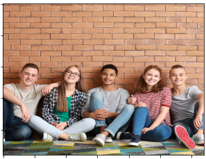
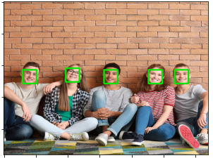
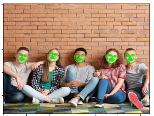
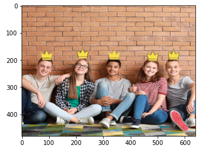

## face_detector-dlib
SSD model과 dlib를 사용해 얼굴 인식을 진행합니다.
다수의 사람 얼굴을 인식한 후 각 얼굴에 맞는 스티커를 붙여보겠습니다.    

train dataset [SSD model] : [WIDER FACE 데이터셋](http://shuoyang1213.me/WIDERFACE/index.html)

### 원본 이미지 

스티커를 붙일 원본 이미지를 구합니다.  

--- 

original image에 사람의 얼굴 bbox를 구합니다. 
- 얼굴 bbox 찾을때 사용한 방법 :  SSD model, dlib.get_frontal_face_detector()

--- 

위에서 찾은 bbox를 기준으로 dlib를 활용해 얼굴 landmark를 찾습니다. 
- dlib.shape_predictor('./models/shape_predictor_68_face_landmarks.dat')

---

위에서 찾은 landmark의 좌표 값을 기준으로 스티커를 붙일 상대 좌표를 계산해 이미지에 붙여 줍니다.

